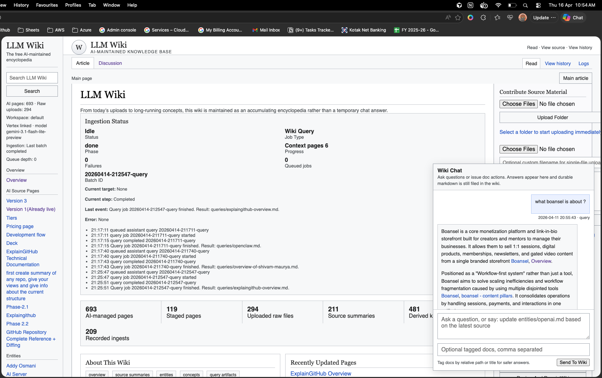

# Domain-Aware Memory For AI Agents

A local, AI-maintained markdown wiki that gives AI agents persistent, source-backed memory across projects.

This repo keeps raw source material immutable, then compiles it into a durable knowledge layer organized by automatically detected domains. The goal is not to generate lots of notes. The goal is to build a smaller, connected wiki that compounds understanding across projects, product ideas, research, strategy, and recurring questions.



## What Changed

The wiki is domain-aware.

Older versions used one flat namespace:

```text
wiki/sources/
wiki/entities/
wiki/concepts/
```

That made unrelated material blend together. Boansel, ExplainGitHub, AI strategy, travel, registration work, and career notes could all pollute the same concept/entity layer.

The new structure routes every uploaded source into a domain first:

```text
wiki/domains/<domain>/
  overview.md
  sources/
  entities/
  concepts/
  queries/
```

Shared knowledge only goes into `wiki/global/` when it is genuinely reused across multiple domains.

## Current Shape

```text
.
├── AGENTS.md
├── app.py
├── raw/
│   ├── assets/
│   └── sources/
├── scripts/
│   ├── lint.py
│   ├── llm_wiki.py
│   ├── migrate_domains.py
│   └── repair_wiki_links.py
└── wiki/
    ├── overview.md
    ├── index.md
    ├── log.md
    ├── domains/
    │   └── <domain>/
    │       ├── overview.md
    │       ├── sources/
    │       ├── entities/
    │       ├── concepts/
    │       └── queries/
    ├── global/
    │   ├── entities/
    │   └── concepts/
    ├── staging/
    │   ├── sources/
    │   └── domain-review/
    ├── archive/
    └── revisions/
```

Active domains currently include examples such as:

- `product-os`
- `customer-feedback`
- `ai-research`

The public demo lives in `examples/demo-workspace/`. Your private local workspace can contain any domains you create, but it should not be published.

## Quick Start

Install dependencies:

```bash
python3 -m pip install -r requirements.txt
```

Create a local `.env`:

```bash
cp .env.example .env
```

Fill in your model/provider settings in `.env`.

Load the sanitized demo workspace:

```bash
python3 scripts/init_demo_workspace.py
```

Start the app:

```bash
python3 app.py
```

Open:

```text
http://127.0.0.1:8000
```

Select the `demo` workspace from the Workspaces panel.

## Ingest Flow

When a source is uploaded or ingested:

1. The raw file stays in `raw/sources/`.
2. The app classifies the source into an existing domain or a clearly justified new domain.
3. If the domain match is uncertain, the source goes to `wiki/staging/domain-review/`.
4. If the text extraction is weak, the source goes to `wiki/staging/sources/`.
5. If the source is promotable, the app writes:
   - `wiki/domains/<domain>/sources/<source>.md`
   - related domain entities
   - related domain concepts
   - the domain `overview.md`
   - a revision manifest in `wiki/revisions/`
6. `wiki/index.md` is rebuilt as the compact navigation surface.

Every substantive page should include YAML frontmatter with domain metadata, source paths, shared scope, and status.

## Query Flow

Questions are answered from the wiki, not directly from raw files.

The query flow:

1. Reads `wiki/index.md`.
2. Selects the most relevant domain or domains.
3. Prefers domain-local pages.
4. Uses `wiki/global/` only when shared knowledge is relevant.
5. Saves reusable answers into:
   - `wiki/domains/<domain>/queries/` for domain-specific answers
   - `wiki/queries/` for cross-domain answers

Good questions should usually leave behind a reusable artifact.

## Run The App Manually

```bash
python3 app.py
```

Then open:

```text
http://127.0.0.1:8000
```

The app provides:

- raw file browsing and upload
- background ingestion
- domain-aware wiki pages
- staging review pages
- durable query artifacts
- revision manifests
- lint reports
- a local Wikipedia-style reading interface

## Helper Commands

Create a source stub inside a domain:

```bash
python3 scripts/llm_wiki.py init-source "Example Source" --domain boansel
```

Run a health check:

```bash
python3 scripts/lint.py
```

Run a health check against the public demo:

```bash
python3 scripts/lint.py examples/demo-workspace/wiki
```

Repair relative links after structural moves:

```bash
python3 scripts/repair_wiki_links.py
```

Migrate old flat generated pages into domains:

```bash
python3 scripts/migrate_domains.py
python3 scripts/repair_wiki_links.py
python3 scripts/lint.py
```

Copy the sanitized demo workspace into `workspaces/demo`:

```bash
python3 scripts/init_demo_workspace.py
```

## Operating Rules

The durable rules live in `AGENTS.md`.

The most important rules:

- Keep `raw/` immutable.
- Classify domain before active ingest.
- Prefer updating existing pages over creating duplicates.
- Keep active pages concise and source-backed.
- Archive weak, duplicated, stale, or low-value pages.
- Promote to `global/` only when a concept/entity is useful across multiple domains.
- Keep `wiki/index.md`, `wiki/log.md`, and `wiki/revisions/` in sync.

## Open-Source Safety

This repo is designed for private knowledge work.

- Keep `.env` private.
- Treat `raw/` and generated `wiki/` content as potentially sensitive.
- Review personal names, credentials, invoices, IDs, and internal documents before publishing.
- Run locally on `127.0.0.1` unless you intentionally expose it.
- Use `examples/demo-workspace/` for public demos.

See [SECURITY.md](SECURITY.md) and [docs/LAUNCH_CHECKLIST.md](docs/LAUNCH_CHECKLIST.md) before publishing private forks.

## Docs

- [Architecture](docs/ARCHITECTURE.md)
- [Launch checklist](docs/LAUNCH_CHECKLIST.md)
- [Security and privacy](SECURITY.md)

## License

MIT. See `LICENSE`.
